# 基于MAX78000的猫咪识别喂食器

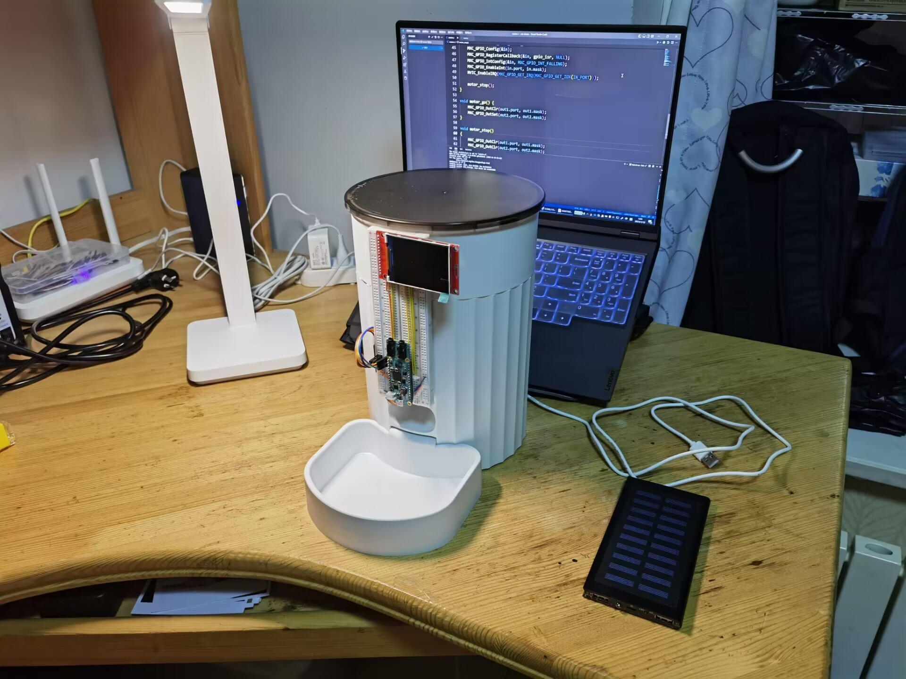

[toc]

## 1. 项目简介

校园里的流浪猫越来越多了，猫咪们的伙食供应成了一个难题。同学们对猫咪的投喂，很难保证他们充足、健康地饮食。此外，寒暑假期间同学不在学校，喵星人们的食物就更加短缺了。

恰逢硬禾学堂开展了基于MAX78000板卡的活动，我基于这个板卡制作了一款猫咪智能喂食器。使用板卡上的摄像头采集图像，并使用AI技术判断图像中是否有猫咪，进而实现自动出食物。

其中，AI技术的实现要得益于MAX78000的强悍的神经网络加速功能，该芯片内置CNN神经网络加速器，经测试，可在14ms内完成对一帧图像的处理。整个过程离线进行，无需联网。

此外，这款智能喂食器采用太阳能电池供电。由于整体系统运行在MCU之上，整体功耗极低。

 

## 2. 项目设计过程

### 2.1 基本思路

软件部分，在电脑上训练神经网络，部署到单片机上运行，使用芯片内置的CNN神经网络加速器。

训练、部署神经网络主要参考板卡官方的`Github`仓库：

- `ai8x-training`仓库，用于在电脑上训练神经网络：https://github.com/MaximIntegratedAI/ai8x-training
- `ai8x-synthesis`仓库，用于把训练好的模型文件转换成c语言代码：https://github.com/MaximIntegratedAI/ai8x-synthesis

- `msdk`仓库，用于编写单片机程序：https://github.com/Analog-Devices-MSDK/msdk

硬件部分，我在网上购买了一个普通的定时喂食器进行改造。拆除了其内部原有的控制电路板，保留其原有的供电接口和电机，并添加了一块L298N电路板用于驱动电机。

为了便于演示和调试，我将MAX78000板卡放置在喂食器外部。后续投入使用时，可将板卡放在装置内部。


### 2.2 模型训练

模型训练采用了板卡官方的`ai8x-training`仓库，我使用了SSD目标检测网络进行训练，这样能很好地排除背景的影响。数据集采用的是`coco2017`数据集，并使用`yolov5`项目为其标注数据。

需要说明的是，我是在Windows系统下直接运行的，这会导致`.sh`脚本不容易运行（当然也可以配置`cygwin`这样的环境，或者按照`wsl`子系统）。但我为了简便，实际操作中未使用仓库提供的`.sh`，而是将其“翻译成”Windows的cmd命令执行。

#### STEP 1：环境配置

**安装CUDA**

如果想使用GPU加速神经网络训练，需要配置`CUDA`环境。官方仓库的`requirements.txt`文件中安装的`pytorch`版本为`1.8.1+cu111`，即依赖`CUDA 11.1`版本。可百度查询安装方法，有很多教程。注意`cudnn`也需要安装，且需要与`CUDA`的版本相适配。

另外，`pytorch`的`1.8`版本之前是`pytorch`官方指明的`LTS(Long Time Support)`长期支持版本，但如今这种说法已被启用，官网的安装引导界面上也在只显示较新的版本。在本次项目中，我使用的仍为这个老版本。但大家也可以尝试新版本，交流群中有老哥有使用`CUDA 11.7`与新版的`pytorch`，也能正常运行。

**克隆代码**

```shell
git clone --recursive https://github.com/MaximIntegratedAI/ai8x-training.git
```

我克隆时的最后一次提交为：Erman Okman on 2022/6/16 22:47:06 bfa433586d97eba01e42d2b0d6e52367ba3c3e35

注意，这里需要加入`--recursive`参数，因为此仓库含有子模块。不加入此参数，或者采用了`download zip`下载的，都会导致子模块没有被加载。

如果你是`git clone`下来的代码，当时忘记了加入`--recursive`参数，可执行：

```shell
git submodule update --init --recursive
```

**安装依赖**

```shell
pip install -r requirements-win-cu11.txt
```

注意，需要根据运行平台选择相应的`requirements.txt`文件。如果想使用新版的`pytorch`，请先安装`pytorch`，这样在执行这条命令的时候就不会再安装旧版的。

**检测环境是否配置完成**

可运行仓库根目录下的`check_cuda.py`来检测环境是否配置成功，下面为我运行后的输出：

```
System:            win32
Python version:    3.8.11 (default, Aug  6 2021, 09:57:55) [MSC v.1916 64 bit (AMD64)]
PyTorch version:   1.8.1+cu111
CUDA acceleration: available in PyTorch
```

#### STEP 2：制作数据集

**下载数据集和标注信息**

我使用了`Github`上的`yolov5`项目训练所使用的`coco2017`数据集，从中筛选出了标签为猫咪的图片。`yolov5`项目提供了对`coco2017`数据集的标注信息。

可在`yolov5`的仓库看到数据集的信息：https://github.com/ultralytics/yolov5/blob/master/data/coco.yaml

相关下载连接如下：

- 训练集，19G, 118k images：http://images.cocodataset.org/zips/train2017.zip
- 验证集，1G, 5k images：http://images.cocodataset.org/zips/val2017.zip

- labels，标注信息：https://github.com/ultralytics/yolov5/releases/download/v1.0coco2017labels.zip

**处理数据集**

下载完成后，我按照以下结构组织目录：

```
└─data
    └─CAT
        ├─images
        │  ├─test2017
        │  └─train2017
        └─labels
            ├─test2017
            └─train2017
```

其中`train2017`为`coco2017`的训练集，`test2017`为`coco2017`的验证集。`lables`标注信息采用`.txt`格式。

然后可使用下面的脚本筛选数据集，只挑出猫咪的照片：

```python
import os
import shutil

OLD_NAME = "train2017"
NEW_NAME = "train"
SELECT_CLASS = 15

OLD_IMAGE_PATH = os.path.join("./images", OLD_NAME)
OLD_LABLE_PATH = os.path.join("./labels", OLD_NAME)
NEW_IMAGE_PATH = os.path.join("./images", NEW_NAME)
NEW_LABLE_PATH = os.path.join("./labels", NEW_NAME)

if __name__ == '__main__':
    if not os.path.exists(NEW_IMAGE_PATH):
        os.mkdir(NEW_IMAGE_PATH)
    if not os.path.exists(NEW_LABLE_PATH):
        os.mkdir(NEW_LABLE_PATH)

    filenames = os.listdir(OLD_IMAGE_PATH)
    filenames_len = len(filenames)
    for i, filename in enumerate(filenames):
        img_name = os.path.splitext(filename)[0]

        old_img = os.path.join(OLD_IMAGE_PATH, filename)
        old_lable = os.path.join(OLD_LABLE_PATH, img_name + ".txt")

        if not os.path.exists(old_lable):
            continue

        new_lable_content = ""
        with open(old_lable, "r") as f:
            for line in f.readlines():
                if line == "":
                    continue
                class_idx = int(line.split(" ")[0])
                if class_idx == SELECT_CLASS:
                    new_lable_content += line

        if new_lable_content != "":
            new_img = os.path.join(NEW_IMAGE_PATH, filename)
            new_lable = os.path.join(NEW_LABLE_PATH, img_name + ".txt")
            
            shutil.copy(old_img, new_img)
            with open(new_lable, "w") as f:
                f.write(new_lable_content)
            
            print("[%5.1f%%]\tcopy" % (i/filenames_len*100), img_name)
        else:
            print("[%5.1f%%]\tskip" % (i/filenames_len*100), img_name)
```

注：脚本需放在`CAT`目录下运行。脚本运行一次之后，需要修改常量再次运行，分别处理训练集和验证集。

```python
OLD_NAME = "test2017"
NEW_NAME = "test"
```

处理完成后，可删除`coco2017`数据集，只保留筛选过的猫咪数据集，目录结构如下：

```
└─data
    └─CAT
        ├─images
        │  ├─test
        │  └─train
        └─labels
            ├─test
            └─train
```

**编写数据集加载文件**

根据`ai8x-training`仓库中其他数据集的格式，需要在`datasets`目录下创建用于加载数据集的`.py`文件，文件名称任意，我将其命名为`cat.py`。

文件里需要有如下格式的内容：

```python
datasets = [
   {
       'name': 'cat',
       'input': (3, 74, 74),
       'output': ([1]),
       'loader': cat_get_datasets_fn,
       'collate': CAT.collate_fn
   }
]
```

各字段含义如下：

- `name`：数据集名称，训练神经网络时传入的名称
- `input`：神经网络输入的尺寸，`(3, 74, 74)`表示：输入图片的宽度为74，高度为74，3表示RGB三个通道

- `output`：神经网络输出分类结果，我们只需要识别猫咪一个类别，此处只有一种输出
- `loader`：加载数据集的函数，需要返回元组`(train_dataset, test_dataset)`。每个数据集都要实现`__len__`和`__getitem__`魔术方法。`__len__`返回数据集的大小。`__getitem__`返回一个训练样本，格式为元组`(input, output)`。对于以图像作为输入的神经网络，`input`为三维的`numpy`数组，表示输入的图像。对于目标检测任务，`output`为元组`(boxes, labels)`，`boxes`为所有的标注框组成的`torch.Tensor` `float32`，每个标注框为 `(x1, y1, x2, y2)`，其中坐标均被归一化。`labels`为所有标注标签构成的`torch.Tensor` `int64`，元素顺序与`boxes`相同，每个标注标签为`output`中定义的取值之一。

- `collate`：把`batch`分离成单个样本。我不太理解为何要传入这个一个函数，感觉程序是由办法自己分离的，可能是还有更复杂的应用场景。这个函数的实现如下：

```python
def collate_fn(batch):
    """
    Since each image may have a different number of objects, we need a collate function
    (to be passed to the DataLoader).
    This describes how to combine these tensors of different sizes. We use lists.
    :param batch: an iterable of N sets from __getitem__()
    :return: a tensor of images, lists of varying-size tensors of bounding boxes and labels
    """
    images = []
    boxes_and_labels = []

    for b in batch:
        images.append(b[0])
        boxes_and_labels.append(b[1])

    images = torch.stack(images, dim=0)
    return images, boxes_and_labels
```

完整的数据集加载文件，请见附件或`release`。

#### STEP 3：开始训练

调用`train.py`进行训练，我最终使用的命令如下：

```shell
python train.py --deterministic --print-freq 200 --pr-curves --epochs 200 --optimizer Adam --lr 0.001 --wd 0 --model ai85tinierssd --use-bias --momentum 0.9 --weight-decay 5e-4 --dataset cat --device MAX78000 --obj-detection --obj-detection-params parameters/obj_detection_params_svhn.yaml --batch-size 16 --qat-policy policies/qat_policy_svhn.yaml --validation-split 0
```

各个参数的含义如下：

| 参数名                 | 参数值                                    | 含义                                                         |
| ---------------------- | ----------------------------------------- | ------------------------------------------------------------ |
| --deterministic        |                                           | 设置随机数种子，制造可重复的训练结果                         |
| --print-freq           | 200                                       | 在每个epech中，训练多少个样本打印一次                        |
| --pr-curves            |                                           | Display the precision-recall curves 显示精确召回曲线         |
| --epochs               | 200                                       | 训练的次数                                                   |
| --optimizer            | Adam                                      | 优化器                                                       |
| --lr                   | 0.001                                     | learning rate 学习率                                         |
| --wd                   | 0                                         | weight decay                                                 |
| --model                | ai85tinierssd                             | 模型选择，模型定义在models文件夹下                           |
| --use-bias             |                                           | 使用偏置                                                     |
| --momentum             | 0.9                                       | 动量，Adam优化器的一个参数                                   |
| --weight-decay         | 5e-4                                      | 权重衰减，可防止过拟合                                       |
| --dataset              | cat                                       | 数据集名称，之前在数据集加载文件中定义的                     |
| --device               | MAX78000                                  | 单片机芯片型号                                               |
| --obj-detection        |                                           | 目标检测                                                     |
| --obj-detection-params | parameters/obj_detection_params_svhn.yaml | 目标识别训练参数                                             |
| --batch-size           | 16                                        | 每次传入神经网络的样本数                                     |
| --qat-policy           | policies/qat_policy_svhn.yaml             | 量化参数的策略                                               |
| --validation-split     | 0                                         | Portion of training dataset to set aside for validation 我们有独立的验证集，无需从训练集中划分，此处设置为0 |

训练好的模型会保存在`logs`目录下，有这些文件：

```
2022.12.27-013527.log
best.pth.tar
checkpoint.pth.tar
qat_best.pth.tar
qat_checkpoint.pth.tar
```

第一个`.log`文件是训练时控制台的输出。

后面四个文件，best训练效果最好的，checkpoint是最新的。带qat的是经过量化的

其中`qat_best.pth.tar`下一步会用到。


### 2.3 模型转换

上一步训练得到的模型是`pytorch checkpoint`格式的，我们需要将其转换成C语言格式，以便在单片机上编程使用。

这项工作使用板卡官方的`ai8x-synthesis`仓库完成。

#### STEP 1：配置环境

**克隆代码**

```shell
git clone --recursive https://github.com/MaximIntegratedAI/ai8x-synthesis.git
```

我克隆时的最后一次提交为：Jake Carter on 2022/12/16 07:48:32 76522d00e1b3466d69eba7dcca21507e9dd48628

**安装依赖**

```shell
pip install -r requirements.txt
```

注：如果使用的是`python`虚拟环境，建议在和`ai8x-training`相同的虚拟环境下安装，因为很多库是一样的

#### STEP 2：把checkpoint格式转化成量化格式

把上一步得到的`qat_best.pth.tar`重命名为`ai85-cat-qat8-q.pth.tar`，复制到trained`文件夹下，使用下面的命令进行转化：

```shell
python quantize.py trained/ai85-cat-qat8.pth.tar trained/ai85-cat-qat8-q.pth.tar --device MAX78000 -v
```

#### STEP 3：编写CNN加速器配置文件

生成C语言代码之前，需要编写一个配置文件，用于告诉程序如果在CNN中加载模型参数。CNN的结构和原理在官方仓库的`README.md`有详细的说明。

此处我主要借鉴了官方给的数字识别demo，把他的配置文件进行了简单的修改。数字识别demo和我这个猫咪识别程序，都是用的SSD网络，其区别仅在于输出尺寸不同。

需要修改的内容仅有四行，把`Layer 16 ~ Layer 19`的`output_processors`参数由`0xfffffffffff00000`改为`0x000000000ff00000`即可。对应在文件的197、209、221、233行。我是复制了一份，重命名为`cat.yaml`，然后进行修改。

#### STEP 4：生成C语言代码

使用下面的命令：

```shell
python ai8xize.py --test-dir sdk/Examples/MAX78000/CNN --prefix cat --checkpoint-file trained/ai85-cat-qat8-q.pth.tar --config-file networks/cat.yaml --device MAX78000 --compact-data --mexpress --timer 0 --display-checkpoint --verbose --overlap-data --mlator --new-kernel-loader --overwrite --no-unload
```

各项参数含义如下：

| 参数名               | 参数值                                     | 备注                                                         |
| -------------------- | ------------------------------------------ | ------------------------------------------------------------ |
| --test-dir           | sdk/Examples/MAX78000/CNN                  | 保存的目录                                                   |
| --prefix             | cat                                        | 保存的文件夹名称                                             |
| --checkpoint-file    | trained/ai85-svhn-tinierssd-qat8-q.pth.tar | STEP 3中量化格式文件                                         |
| --config-file        | networks/cat.yaml                          | 网络配置文件                                                 |
| --device             | MAX78000                                   | 单片机的芯片型号                                             |
| --compact-data       |                                            | 使用memcpy()加载输入数据以节省代码空间（默认也是开启的）     |
| --mexpress           |                                            | use express kernel loading（默认也是开启的）                 |
| --timer              | 0                                          | use timer to time the inference (default: off, supply timer number) 是否使用timer记录CNN的运行时间 |
| --display-checkpoint |                                            | show parsed checkpoint data                                  |
| --verbose            |                                            | 详细输出                                                     |
| --overlap-data       |                                            | 允许输出覆盖输入                                             |
| --mlator             |                                            | 使用硬件交换输出字节                                         |
| --new-kernel-loader  |                                            | （默认也是开启的）                                           |
| --overwrite          |                                            | 覆盖目标（如果存在）                                         |
| --no-unload          |                                            | 禁用cnn_unload()函数                                         |

运行完成后，会在`sdk/Examples/MAX78000/CNN`目录下得到生成的文件

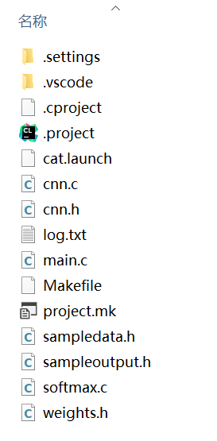

这是一个简易的C语言工程，实现了CNN加速器的初始化和调用，且帮我们配置好了编译指令。


### 2.4 编写C语言程序

#### STEP1：配置环境

这里的环境很好配置，对于`Windows`系统，不需要到从`Github`上克隆代码，可直接使用官方的exe程序安装：https://www.maximintegrated.com/en/design/software-description.html/swpart=SFW0010820A

安装完成后，还要需要对`VSCode`稍加配置，随后便可使用`VSCode`完成编译、烧录等操作。配置方法和使用方法详见官方`Github`仓库`README.md`文件：https://github.com/Analog-Devices-MSDK/VSCode-Maxim

#### STEP2：神经网络输出结果处理

我使用的是SSD目标检测网络，该网络输出的信息较为复杂，是一些列目标检测框的概率，需要进行`softmax`归一化、`nms`非极大值抑制等操作、坐标转换。

这里主要参考了官方仓库的`digit-detection-demo`项目：https://github.com/Analog-Devices-MSDK/msdk/tree/main/Examples/MAX78000/CNN/digit-detection-demo。这个项目也是使用了SSD目标检测网络。项目中的`post_process.h/.c`和就是对SSD网络输出结果的解析。

**输出结果的格式**

SSD网络的输出分为两部分，一部分是候选框，零一部分是候选框的分类。在官方的代码中，`get_prior_locs()`函数是从神经网络的输出中读取候选框，`get_prior_cls()`是获取候选框的分类，下面为这两个函数的实现。

```c
void get_prior_locs(void)
{
    int8_t *loc_addr = (int8_t *)0x50403000;

    int ar_idx, scale_idx, rel_idx, prior_idx, prior_count;

    for (ar_idx = 0; ar_idx < NUM_ARS; ++ar_idx) {
        int8_t *loc_addr_temp = loc_addr;

        for (scale_idx = 0; scale_idx < NUM_SCALES; ++scale_idx) {
            prior_count = SQUARE(dims[scale_idx]);

            for (rel_idx = 0; rel_idx < prior_count; ++rel_idx) {
                prior_idx = get_prior_idx(ar_idx, scale_idx, rel_idx);
                memcpy(&prior_locs[LOC_DIM * prior_idx], loc_addr_temp, LOC_DIM);
                loc_addr_temp += LOC_DIM;
            }
        }

        loc_addr += 0x8000;
    }
}
```

```c
void get_prior_cls(void)
{
    int8_t *cl_addr = (int8_t *)0x50803000;

    int ar_idx, cl_idx, scale_idx, rel_idx, prior_idx, prior_count;

    for (ar_idx = 0; ar_idx < NUM_ARS; ++ar_idx) {
        for (cl_idx = 0; cl_idx < NUM_CLASSES; cl_idx += 4) {
            int8_t *cl_addr_temp = cl_addr;

            for (scale_idx = 0; scale_idx < NUM_SCALES; ++scale_idx) {
                prior_count = SQUARE(dims[scale_idx]);

                for (rel_idx = 0; rel_idx < prior_count; ++rel_idx) {
                    prior_idx = get_prior_idx(ar_idx, scale_idx, rel_idx);
                    memcpy(&prior_cls[NUM_CLASSES * prior_idx + cl_idx], cl_addr_temp, 4);
                    cl_addr_temp += 4;
                }
            }

            cl_addr += 0x8000;

            if ((cl_addr == (int8_t *)0x50823000) || (cl_addr == (int8_t *)0x50c23000)) {
                cl_addr += 0x003e0000;
            }
        }
    }

    softmax();
}
```

可以看到，两个函数的结构十分相似。SSD是一个多尺度网络，会对卷积到不同程度的隐含层进行回归，这样能兼顾对大物体和小物体的检测效果。这个神经网络中一共有`NUM_ARS = 4 `种尺度，即两个函数的第一层循环。里层的几个循环是枚举尺度`NUM_SCALES`，枚举候选框`prior_count`。

关于函数中CNN输出地址的确定，可以在上一步生成C语言代码的时候，不加`--no-unload`参数，这样就可在生成的`cnn_unload()`函数中看到各个输出层的地址。猫咪识别网络的输出地址与官方的demo稍有不同，两部分输出分别从`0x50403000`和`0x5080b000`开始，并都以`0x8000`步进。

另外，在官方的数字检测项目中，神经网络有12种类别输出，其中10个输出表述`0~9`数字，另有1个输出表示背景，另外1个意义不明，我猜测是训练的时候有一个`unknown`分类，用来增加模型的抗干扰能力。而我的模型实际上是有两种输出，一个是猫咪，另一个是背景。所以需要设置`NUM_CLASSES = 2`。

**对输出结果的处理**

对输出结果的处理主要有三种：`softmax`归一化、`nms`非极大值抑制等操作、坐标转换。

`softmax`归一化针对的的模型输出的分类结果，模型输出的是`-128~127`之间的整数，我们要将其归一化为`0~1`之前的小数。实际上，这一步在上面的`get_prior_cls()`函数最后就进行了，可以看到调用了名为`softmax`的函数。

`nms`非极大值已知解决的是一个物体上出现多个框的问题，并将其合并为一个框。如下图汽车的例子所示。

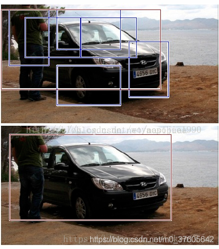

而判断是否需要合并的重要指标是IOU（交并比），描述的是两个候选框的重叠程度。对于IOU大于阈值的候选框，我们可将其合并。这里我设置的阈值为30%。

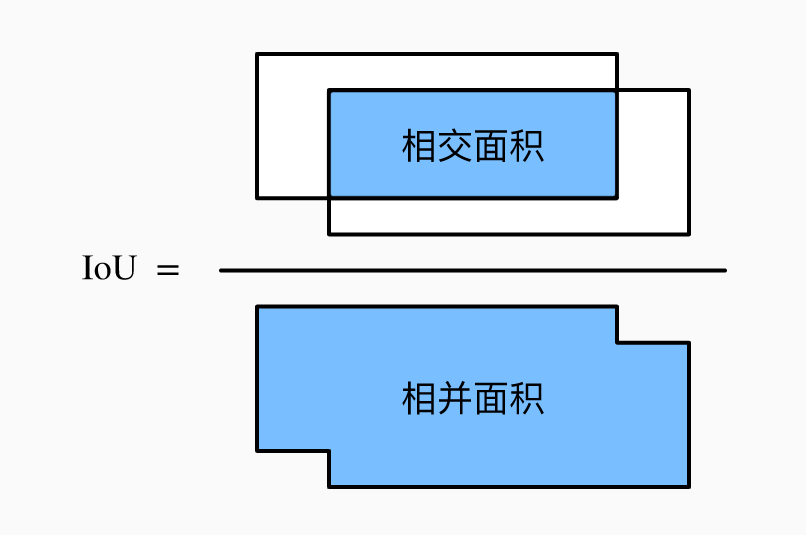

坐标转换主要涉及三种坐标，第一个是神经网络输出的候选框坐标，这个坐标是一个`-127~128`的整数，需要通过特定的公式转换成`(x, y, w, h)`坐标，其中`x, y`表示候选框的中心点坐标，`w, h`表示候选框的宽度和高度。在屏幕上绘图显示的时候，还需要转换成`(x1, y1, x2, y2)`坐标，其中`x1, y1`是候选框的左上顶点坐标，`x2, y2`是候选框的右下顶点坐标。

#### STEP3：屏幕驱动

在显示屏上绘制摄像头的画面和识别的结果，可以帮助我们更好地调试。在官方的例子中，常使用一款2.4寸的`ILI9341`屏幕。我也买到了相同规格的屏幕，但他们接口稍有不同，我买到这块屏幕无法直接插在板卡上。我查阅了屏幕驱动库的源代码，找到了接线的方式。

- CLK：P0_7
- MOSI：P0_5
- MISO：P0_6
- CS：P0_11
- DC：P0_8

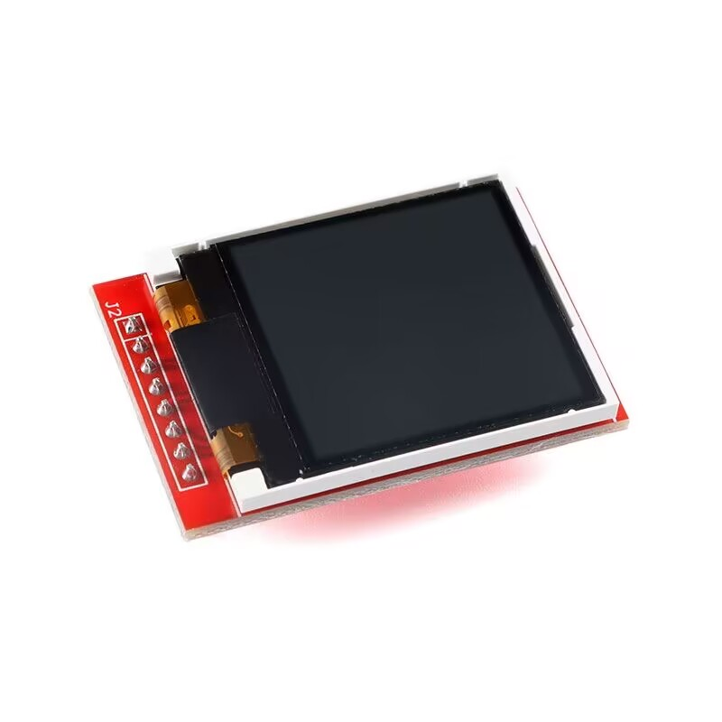

屏幕初始化代码

```c
MXC_TFT_Init(MXC_SPI0, 1, NULL, NULL);
MXC_TFT_SetRotation(ROTATE_270); // 设置屏幕旋转270度显示
MXC_TFT_SetForeGroundColor(WHITE); // 设置字符颜色为白色
MXC_TFT_ClearScreen(); // 清屏
```

我封装了一个显示屏输出文字函数

```c
void TFT_Print(int x, int y, char *str, int length)
{
    text_t text;
    text.data = str;
    text.len = length;

    MXC_TFT_PrintFont(x, y, font, &text, NULL);
}
```

函数调用`MXC_TFT_PrintFont()`库函数完成文字输出，font为字体文件，定义如下。字体文件是从官方的示例程序中找到的。

```c
static int font = (int)&SansSerif16x16[0];
```

#### STEP4：电机控制

猫咪喂食器的出食物是采用一个5V直流减速电机控制，电机每转动一定角度，便会出一份食物。

当CNN检测到猫咪后，我进行了一次滤波，只有当检测到的猫咪的概率大于阈值，且猫咪在画面中的占比大于阈值，电机才会开启。

**电机驱动**

我使用了L298N电路板驱动电机。这是个两路电机控制板。对于每路电机，通过两个逻辑信号进行控制。如果两个信号相同，电机不转动。不同的话有两种情况，分别控制电机往两个方向转动。

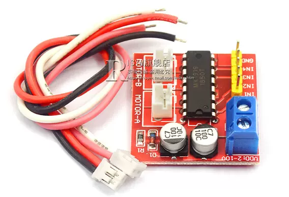

对于这两个信号，我把IO口配置为输出模式，配置方法如下：

```c
out1.port = OUT1_PORT;
out1.mask = OUT1_PIN;
out1.pad = MXC_GPIO_PAD_NONE;
out1.func = MXC_GPIO_FUNC_OUT;
out1.vssel = MXC_GPIO_VSSEL_VDDIOH; // 3.3V
MXC_GPIO_Config(&out1);
```

需要注意的是，要设置下`vssel = MXC_GPIO_VSSEL_VDDIOH`，不然默认输出的是`1.8V`。

**检测开关**

喂食器装置上有一个检测开关，每当电机转动到出食物的角度，这个开关会经历一次`按下-弹开`。这里我使用`IO`口中断来处理，这样因为等待电机转动到位而耽误程序执行其他操作。

那个检测开关平时是常通的，按下后会断开。我把开关的一段接地，另一端接`GPIO`上拉输入。如果检测到下降沿，则说明经历一次`按下-弹开`。配置代码如下：

```c
in.port = IN_PORT;
in.mask = IN_PIN;
in.pad = MXC_GPIO_PAD_PULL_UP;
in.func = MXC_GPIO_FUNC_IN;
in.vssel = MXC_GPIO_VSSEL_VDDIOH;
MXC_GPIO_Config(&in);
MXC_GPIO_RegisterCallback(&in, gpio_isr, NULL);
MXC_GPIO_IntConfig(&in, MXC_GPIO_INT_FALLING);
MXC_GPIO_EnableInt(in.port, in.mask);
NVIC_EnableIRQ(MXC_GPIO_GET_IRQ(MXC_GPIO_GET_IDX(IN_PORT)));
```

`MXC_GPIO_RegisterCallback()`函数为注册中断回调函数，第二个参数为回调函数名，第三个参数为回调函数传入的参数，这里我们不需要传入参数，填入`NULL`即可。

至此，程序部分设计完成，完整的流程图如下：

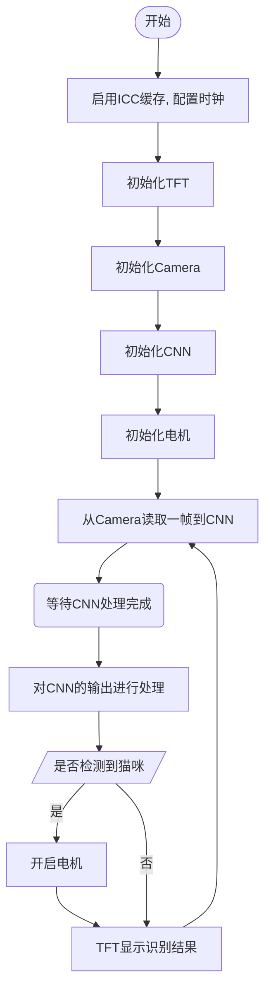


### 2.5 组装装置

喂食器的主题部分是采用网上购买的普通定时喂食器进行改造的，我移除了原有的电路板，连接了MAX78000板卡。保留了原来的供电接口，可使用太阳能充电宝供电。

整个装置的结构示意图：

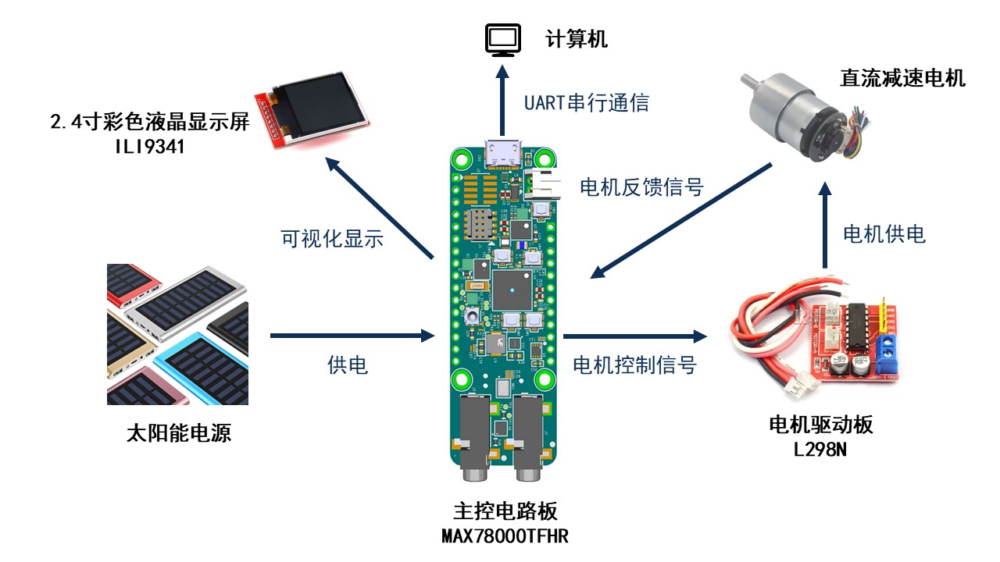

对应到实物连接，这也是整个装置最核心的部分

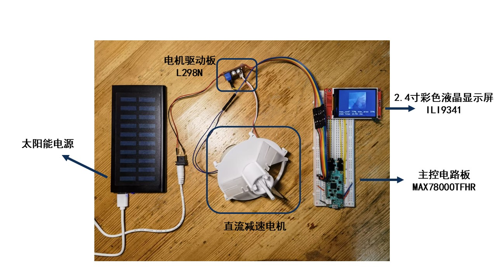

将其安装上去

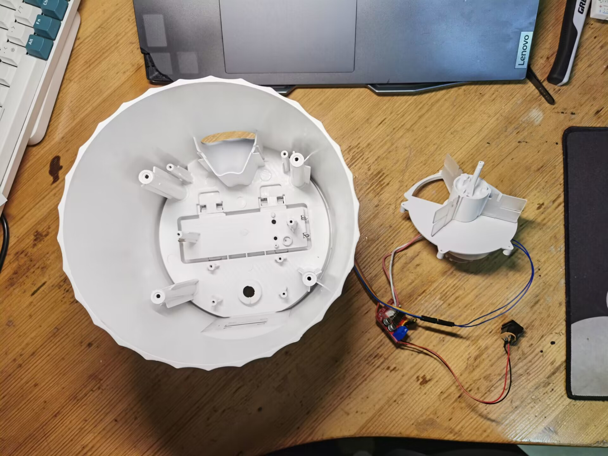

安装后

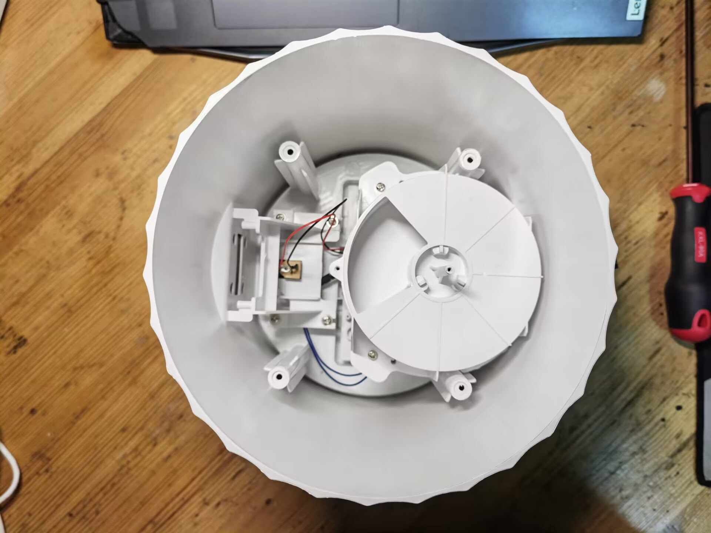

安装顶部外壳

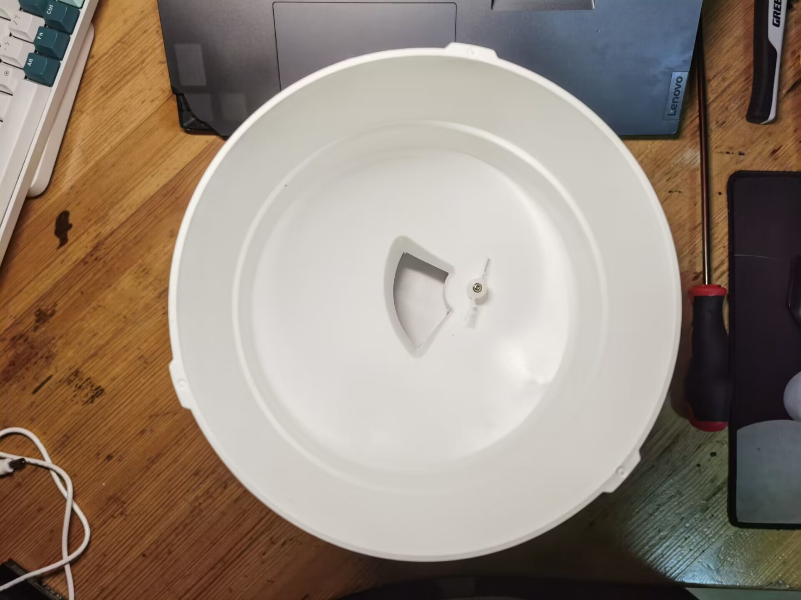

连接MAX78000板卡

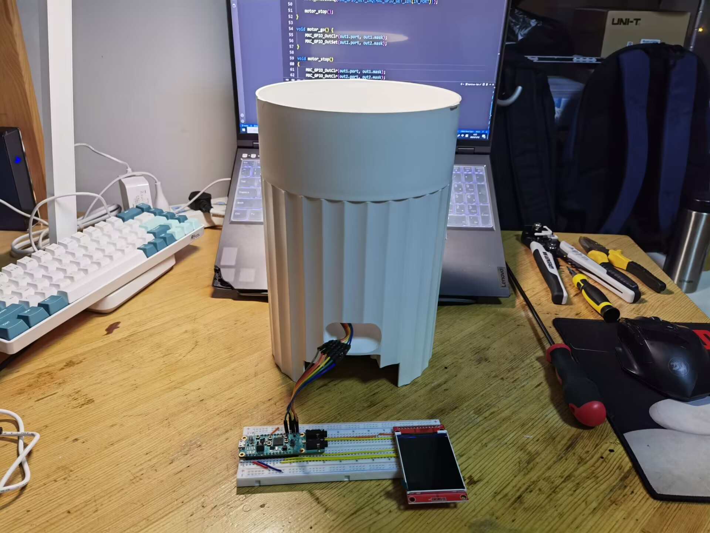

为了方便演示和调试，我把板卡固定在了喂食器外壁上，后续可转移至内部

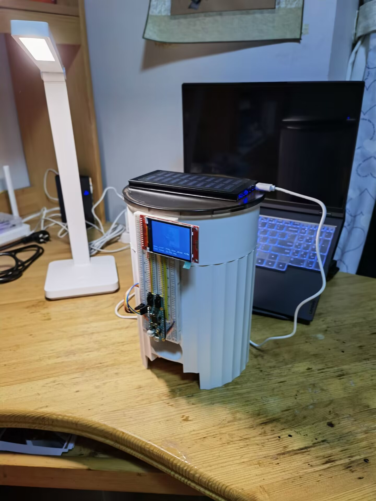

安装食物槽


至此，猫咪识别喂食器就制作完成啦！


## 3. 项目复现方法（Quick Start）

本项目的代码仅支持`MAX78000FTHR`板卡，屏幕仅支持2.4寸`ILI9341`驱动TFT屏幕，以下是我购买相关物料的链接：

- `MAX78000FTHR`板卡：~~【淘宝】https://m.tb.cn/h.UPodi8b?tk=oBm9d52AqWp CZ0001 「ADI美信MAX78000开发板快速实现超低功耗、人工智能 (AI) 方案」~~ 商品已下架，可尝试联系此店铺客服，或联系电子森林/硬禾学堂
- 2.4寸`ILI9341`驱动TFT屏幕：【淘宝】https://m.tb.cn/h.UPodTPL?tk=DI4Qd52AkOL CZ3457 「彩色液晶屏模块 1.44/1.8/2.0/2.2/2.4/2.8/3.2/3.5/4.0寸TFT彩屏」
- L298N电机驱动模块：【淘宝】https://m.tb.cn/h.UPodNcG?tk=ZI56d52AeKf CZ3457 「L298N电机驱动板模块直流步进电机马达智能车机器人配件TB6612FNG」
- 太阳能充电宝：【淘宝】https://m.tb.cn/h.UkFwPz3?tk=x2Q6d5da45e CZ0001 「官方正品光能太阳能50000M充电宝超薄小巧便携大容量迷你适用华为荣耀苹果小米oppo安卓手机专用快充1万毫安」
- 猫咪喂食器：

**STEP 1：**配置MAX78000板卡开发环境，最简单的办法是在`Windows`平台上使用官方提供的`MaxinMicroSDK.exe`安装：https://www.analog.com/en/design-center/evaluation-hardware-and-software/software/software-download.html?swpart=sfw0010820a

**STEP 2：**参考官方仓库配置`VSCode`，了解如何编译、烧录程序：https://github.com/Analog-Devices-MSDK/VSCode-Maxim

**STEP 3：**下载项目的C语言程序，可在我的`Github`上下载：https://github.com/xzqiaochu/cat-demo

**STEP 4：**接线

板卡连接显示屏，线序：

- CLK：P0_7
- MOSI：P0_5
- MISO：P0_6
- CS：P0_11
- DC：P0_8

板卡连接L298N和检测开关，线序：

- P0_16：L298N模块IN1
- P0_17：L298N模块IN2
- P0_19：连接检测开关一端口，检测开关另一端口接地

L298N 5V供电

**STEP 5：**编译、烧录程序至`MAX78000FTHR`板卡

**串口输出**

烧录成功后，可在串口调试助手查看输出。程序复位后，会首先输出：

```
Cat Detection Demo
Init System...	Done
Init TFT... Done
Init CNN... Done
Init Motor... Done
CNN time: 13.761ms
```

若产生上述输出，说明程序中的初始化操作正常执行，并完成了一次CNN神经网络处理。

之后会持续输出：`CNN time: 13.761ms`

若检测到猫咪，会产生如下格式的输出：

```
[0](73%) x1: 0.16, y1: 0.05, x2: 0.68, y2: 0.86
max_conf: 73, max_area: 43
CNN time: 13.761ms
```

- `(73%)`：表示识别结果的可信度

- `x1, y1, x2, y2`：表示框住猫咪的矩形框在画面中的位置，左上顶点和右下顶点的归一化坐标

- `max_conf: 73`：表示当前一帧画面中，可信度最高的矩形框的可信度

- `max_area: 43`：表示当前一帧画面中，可信度最高的矩形框的在画面中的面积占比

**TFT屏幕输出**

也可在TFT屏幕上看到更为直观的结果。屏幕上会实时显示摄像头拍摄到的画面，若识别出喵咪，会用橙色的框将其框出来。下图由于曝光问题有些不清楚，画面中为一张猫咪的照片。

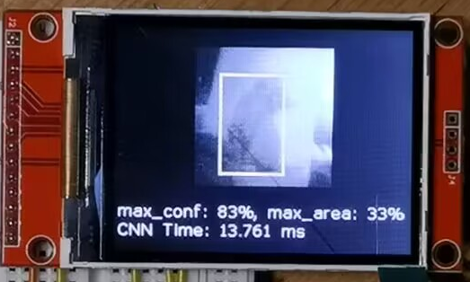


## 4. 项目总结

在本次项目中，让我收获最大的是了解到了嵌入式AI开发的全过程。板卡官方提供的SDK很接近底层，虽然开发起来不如一些高度集成的AI设备好用（如K210开发板），但却使我更好地理解了底层运作的原理，也为我提供了更多的选择，更能满足定制化的需求。

猫咪识别喂食器是我“蓄谋已久”的项目。之前也做过一个原型机，但当时的方案是用`ESP32`采集图像，传输到电脑上完成AI识别。但如果想推广使用的话，购买云服务器定会是一笔不小的费用。嵌入式AI给我一个新的思路，在单片机上上使用CNN神经网络加速器完成AI计算，无需联网。

最后，感谢硬禾举办这样一个活动，给了我一次探索嵌入式AI的机会，也要感谢美信和ADI工程师们提供的详细的文档，~~虽然有坑~~，但已经比较完善了，在很大程度上方便了我的开发。
